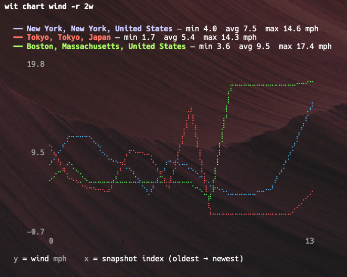

# wit

Git-style CLI for tracking, comparing, and charting weather over time.



```
wit tokyo                 # current weather for any city
wit tokyo 7d              # now vs 7 days ago
wit tokyo..boston          # compare two cities
wit tokyo jan..jul         # compare January vs July
```

Running `wit` with no arguments shows a status dashboard across everything you're tracking:

```
╭──────────────────────────────────────┬──────┬───────┬───────────┬────────────────────┬──────────┬──────────┬─────────────╮
│ Location                             ┆ Temp ┆ Feels ┆ H / L     ┆ Conditions         ┆ Wind     ┆ Humidity ┆ Updated     │
╞══════════════════════════════════════╪══════╪═══════╪═══════════╪════════════════════╪══════════╪══════════╪═════════════╡
│ New York, New York, United States    ┆ 35F  ┆ 35F   ┆ 39F / 31F ┆ 🌦 Moderate drizzle ┆ 5 mph SW ┆ 95%      ┆ 02/18 12:00 │
├╌╌╌╌╌╌╌╌╌╌╌╌╌╌╌╌╌╌╌╌╌╌╌╌╌╌╌╌╌╌╌╌╌╌╌╌╌╌┼╌╌╌╌╌╌┼╌╌╌╌╌╌╌┼╌╌╌╌╌╌╌╌╌╌╌┼╌╌╌╌╌╌╌╌╌╌╌╌╌╌╌╌╌╌╌╌┼╌╌╌╌╌╌╌╌╌╌┼╌╌╌╌╌╌╌╌╌╌┼╌╌╌╌╌╌╌╌╌╌╌╌╌┤
│ Tokyo, Tokyo, Japan                  ┆ 44F  ┆ 48F   ┆ 53F / 35F ┆ 🌦 Light drizzle    ┆ 14 mph N ┆ 49%      ┆ 02/18 12:00 │
├╌╌╌╌╌╌╌╌╌╌╌╌╌╌╌╌╌╌╌╌╌╌╌╌╌╌╌╌╌╌╌╌╌╌╌╌╌╌┼╌╌╌╌╌╌┼╌╌╌╌╌╌╌┼╌╌╌╌╌╌╌╌╌╌╌┼╌╌╌╌╌╌╌╌╌╌╌╌╌╌╌╌╌╌╌╌┼╌╌╌╌╌╌╌╌╌╌┼╌╌╌╌╌╌╌╌╌╌┼╌╌╌╌╌╌╌╌╌╌╌╌╌┤
│ Boston, Massachusetts, United States ┆ 52F  ┆ 42F   ┆ 56F / 31F ┆ 🌥 Overcast         ┆ 17 mph S ┆ 46%      ┆ 03/20 16:43 │
╰──────────────────────────────────────┴──────┴───────┴───────────┴────────────────────┴──────────┴──────────┴─────────────╯
```

Compare locations side by side at any point in time:

```
$ wit diff tokyo..boston 21d

╭─────────────┬──────────────────────────────────┬───────────────────────────────────────────────────┬────────╮
│             ┆ Tokyo, Tokyo, Japan (2026-02-27) ┆ Boston, Massachusetts, United States (2026-02-27) ┆ Delta  │
╞═════════════╪══════════════════════════════════╪═══════════════════════════════════════════════════╪════════╡
│ Temperature ┆ 48F                              ┆ 31F                                               ┆ -17F   │
├╌╌╌╌╌╌╌╌╌╌╌╌╌┼╌╌╌╌╌╌╌╌╌╌╌╌╌╌╌╌╌╌╌╌╌╌╌╌╌╌╌╌╌╌╌╌╌╌┼╌╌╌╌╌╌╌╌╌╌╌╌╌╌╌╌╌╌╌╌╌╌╌╌╌╌╌╌╌╌╌╌╌╌╌╌╌╌╌╌╌╌╌╌╌╌╌╌╌╌╌┼╌╌╌╌╌╌╌╌┤
│ Feels like  ┆ 44F                              ┆ 25F                                               ┆ -19F   │
├╌╌╌╌╌╌╌╌╌╌╌╌╌┼╌╌╌╌╌╌╌╌╌╌╌╌╌╌╌╌╌╌╌╌╌╌╌╌╌╌╌╌╌╌╌╌╌╌┼╌╌╌╌╌╌╌╌╌╌╌╌╌╌╌╌╌╌╌╌╌╌╌╌╌╌╌╌╌╌╌╌╌╌╌╌╌╌╌╌╌╌╌╌╌╌╌╌╌╌╌┼╌╌╌╌╌╌╌╌┤
│ Wind        ┆ 2 mph E                          ┆ 4 mph SE                                          ┆ +2mph  │
├╌╌╌╌╌╌╌╌╌╌╌╌╌┼╌╌╌╌╌╌╌╌╌╌╌╌╌╌╌╌╌╌╌╌╌╌╌╌╌╌╌╌╌╌╌╌╌╌┼╌╌╌╌╌╌╌╌╌╌╌╌╌╌╌╌╌╌╌╌╌╌╌╌╌╌╌╌╌╌╌╌╌╌╌╌╌╌╌╌╌╌╌╌╌╌╌╌╌╌╌┼╌╌╌╌╌╌╌╌┤
│ Humidity    ┆ 47%                              ┆ 81%                                               ┆ +34%   │
╰─────────────┴──────────────────────────────────┴───────────────────────────────────────────────────┴────────╯
```

## Install

```
cargo install --path .
```

## Getting started

```
wit init                  # create the weather repo
wit add tokyo             # track a city (geocodes automatically)
wit add boston
wit snap                  # fetch current weather for all locations, commit
```

Add the places you care about, run `wit snap` whenever you want (or on a cron), and you'll accumulate a history you can diff and chart later.

## Charts

```
wit chart temp -l tokyo,boston -r 30d
wit chart humidity -r 2w
wit chart wind
```

Available metrics: `temp`, `feels`, `high`, `low`, `humidity`, `pressure`, `wind`, `gusts`, `uv`, `precip`, `cloud`.

## Quick queries

Time specs: `7d`, `2w`, `3m`, `1y`, `yesterday`, month names (`jan`, `january`), years (`2024`).

```
wit tokyo..boston 1w       # compare two cities a week ago
wit tokyo jan..jul         # compare January vs July
```

## Commands

| Command | What it does |
|---------|-------------|
| `wit init [path]` | Initialize repo (defaults to `~/.wit`) |
| `wit add <city>` | Geocode and start tracking a location |
| `wit snap` | Fetch + commit weather for all tracked locations |
| `wit status [location]` | Dashboard of current conditions |
| `wit log [location] [-n N]` | Commit history |
| `wit locations` | List tracked locations with coords |
| `wit diff <args>` | Compare snapshots (same syntax as quick queries) |
| `wit backfill <location> --since <spec>` | Backfill historical data |
| `wit chart [metric] -l <locations> -r <range>` | ASCII chart over time |

## Configuration

Settings live in `~/.wit/wit.toml`. Right now the main thing you can change is units:

```toml
[settings]
units = "imperial"   # or "metric"
```

Locations are added via `wit add` and tracked in the same file.

## How it works

The repo layout under `~/.wit` looks like:

```
.git/
wit.toml
locations/
  tokyo/
    meta.toml        # name, coordinates, timezone
    current.toml     # latest snapshot
  boston/
    meta.toml
    current.toml
```

Each snapshot captures temperature (current, feels like, high, low), wind (speed, direction, gusts), atmosphere (humidity, pressure, cloud cover, UV), and precipitation (amount, probability, snowfall). All data comes from [Open-Meteo](https://open-meteo.com/), no API key needed.

## License

MIT
